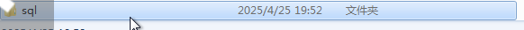
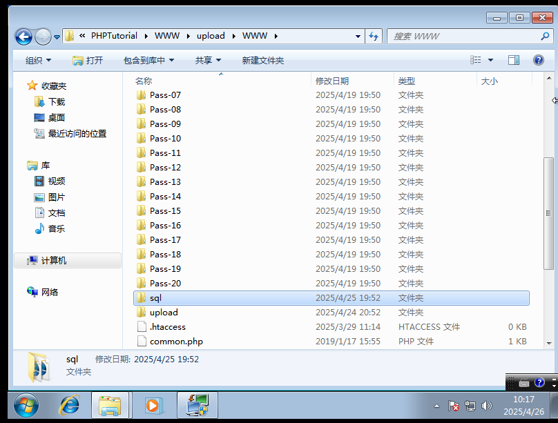
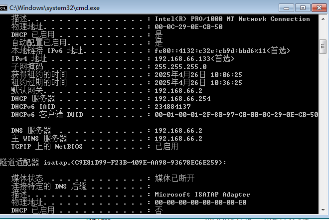
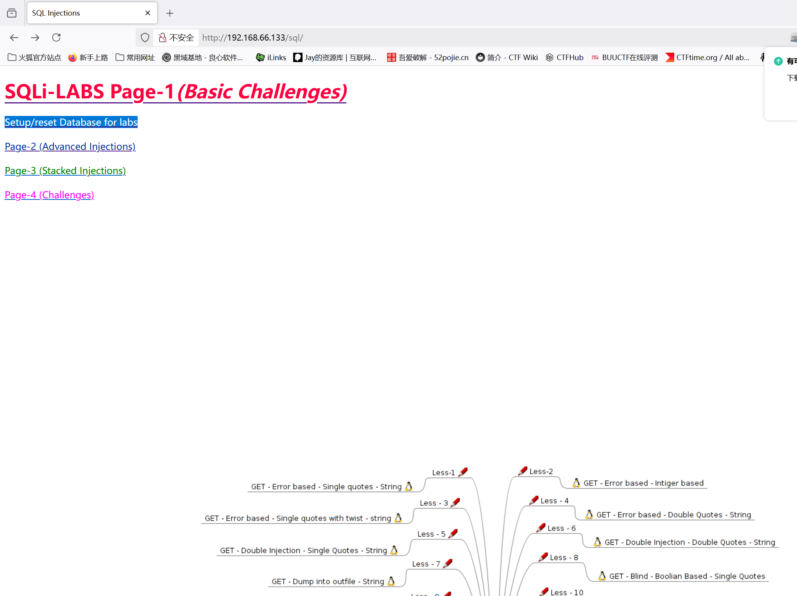
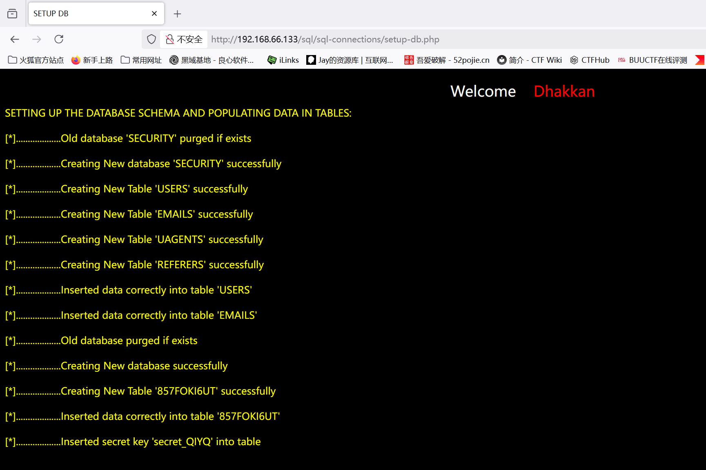

# 靶场搭建

　　靶场源文件：[sqli-labs-master.zip](assets/sqli-labs-master-20250426101231-lo1jnxr.zip)

　　环境搭建我是在win7虚拟机上使用 phpstudy2018 搭建

　　将文件压缩完毕文件夹命名为sql

　　打开设置-网站根目录将sql放入放进去

　　找到虚拟机ip

　　然后本机浏览器访问：http://192.168.66.133/sql

　　然后点击标蓝选项安装数据库

　　这个页面即为成功
